# Technical Specification

# 0. Agent Action Plan

## 0.1 Intent Clarification

Based on the security concern described, the Blitzy platform understands that the security vulnerability to resolve is a **Critical authentication bypass (GHSA-8783-3wgf-jggf, CVSS 9.1, CWE-287)** affecting `@budibase/backend-core` versions ≤ 3.35.3. The vulnerability is rooted in `packages/backend-core/src/middleware/matchers.ts`, where the public-endpoint matching regex is compiled without an end anchor and (historically) tested against the full request URL including the query string. An unauthenticated attacker can append a known public-endpoint substring (e.g. `?x=/api/system/status`) to any otherwise-protected request URL and cause the `authenticated()` middleware to flag the request as `publicEndpoint = true`, which in turn causes the worker's central authorization gate at `packages/worker/src/api/index.ts` (lines 160–171) to skip the `403 Unauthorized` throw and forward the request to the route handler.

### 0.1.1 Core Security Objective

- **Vulnerability category:** Code vulnerability (regex anchoring defect) in shared middleware — single root-cause fix in `matchers.ts` eliminates the bypass for every consumer of `auth.buildAuthMiddleware()`.
- **Severity level:** Critical (CVSS 9.1, AV:N/AC:L/PR:N/UI:N/S:U/C:H/I:H/A:L per the user-supplied score).
- **Security requirements (with enhanced clarity):**
  - Anchor the compiled `RegExp` for every public-endpoint pattern so that it matches **only** at the start of the path *and* terminates at either the path end (`$`) or the query-string delimiter (`\?`). This eliminates the "match anywhere in the URL" exploit primitive.
  - Constrain the `regex.test()` evaluation target to the path component only (`ctx.path` / `ctx.request.path`), excluding the query string from the authentication decision under all conditions. The repository already executes `regex.test(ctx.path)` on line 32; this directive locks that property in alongside Directive 1 as belt-and-braces defense in depth.
  - Restore the security invariant that **every** `loggedInRoutes` endpoint in `packages/worker/src/api/routes/` returns HTTP 403 to unauthenticated callers, even when a known no-auth pattern is injected through the query string.
  - Preserve unchanged behavior for legitimate public endpoints listed in `PUBLIC_ENDPOINTS` (e.g. `/api/system/status`, `/api/system/environment`, `/api/global/configs/public`, `/api/global/auth/:tenantId`) so that anonymous health checks, login flows, and SSO callbacks continue to function.
- **Implicit security needs surfaced:**
  - **Backward compatibility:** No public API of `matchers.ts` (the exported `buildMatcherRegex` and `matches` functions) may change shape; both are consumed by `authenticated.ts`, `csrf.ts` (via `noCsrfPatterns`), and the tenancy middleware (via `NO_TENANCY_ENDPOINTS`). All call sites must continue to compile and operate without modification.
  - **Zero downtime:** The fix is a pure code patch with no runtime configuration, schema migration, or restart coordination beyond the standard rolling release. No environment variable, secret, or infrastructure change is required.
  - **Disclosure compliance:** The fix must align with the disclosure policy stated in `SECURITY.md` — only the latest major version is patched and disclosure is coordinated through `community@budibase.com` and `huntr.dev`.
  - **Defense in depth:** Applying both Directive 1 (anchored regex) **and** Directive 2 (path-only test) yields two independent barriers; even if a future change accidentally re-introduces `ctx.request.url` in the test path, the anchored regex would still reject query-string-injected patterns, and vice versa.

### 0.1.2 Special Instructions and Constraints

- **CRITICAL — Minimal-change directive:** The user's "Constraints" block explicitly forbids any modification outside `matchers.ts` other than adding regression tests and (per Directives 5 and 6) running existing audit/test tooling. The Blitzy platform is bound to the smallest possible source-code surface that fully eliminates the bypass.
- **Files explicitly off-limits:**
  - `packages/backend-core/src/middleware/authenticated.ts` — no changes
  - `packages/worker/src/api/index.ts` — no changes
  - `packages/worker/src/api/routes/endpointGroups/standard.ts` — no changes (the `loggedInRoutes`, `builderOrAdminRoutes`, `adminRoutes` group definitions remain intact)
  - All route handler / controller files under `packages/worker/src/api/routes/` and `packages/worker/src/api/controllers/`
  - The `noAuthOptions` / `PUBLIC_ENDPOINTS` allowlist and any business logic
  - Any unrelated dependency manifest entries
- **Public endpoint pattern list:** The `noAuthOptions` (and the worker's `PUBLIC_ENDPOINTS` array in `api/index.ts`) MUST NOT be altered — only the regex compilation strategy is changing.
- **Dependency upgrades:** Out of scope. The fix is purely a code change in TypeScript source; no `package.json` or `yarn.lock` modification is permitted.
- **Functional preservation:** All legitimate public endpoints (`/api/system/status`, `/api/system/environment`, `/api/global/configs/public`, `/api/global/auth/default`) must remain reachable without authentication after the fix (Directive 4 success criterion).
- **User Examples (preserved exactly as supplied):**
  - **User Example — Bypass payload to verify all 6 endpoints return 403:**
    - `POST /api/global/users/search?x=/api/system/status`
    - `GET /api/global/self?x=/api/system/status`
    - `GET /api/global/users/accountholder?x=/api/system/status`
    - `GET /api/global/template/definitions?x=/api/system/status`
    - `POST /api/global/license/refresh?x=/api/system/status`
    - `POST /api/global/event/publish?x=/api/system/status`
  - **User Example — Regression assertion for matchers.ts pattern:** "pattern `/api/system/status` MUST NOT match string `/api/global/users/search?x=/api/system/status`"
  - **User Example — Required RegExp construction:** `new RegExp('^' + route + '(\\?|$)')` (replaces existing `new RegExp(`^${route}`)`)
  - **User Example — Required test target:** `regex.test(ctx.request.path)` (semantically equivalent to the existing `regex.test(ctx.path)` already in line 32)
- **Web search requirements (executed):** Vulnerability research conducted against GitHub Security Advisories Database, NVD/MITRE CVE listings, and public security write-ups for the bypass family — see Section 0.2.
- **Change scope preference:** **Minimal**. Two source-code line edits in `matchers.ts` plus one new (or appended) regression-test spec in `packages/backend-core/src/middleware/tests/`. No feature additions, no refactoring, no formatting churn.

### 0.1.3 Technical Interpretation

This security vulnerability translates to the following technical fix strategy:

> *To resolve the unanchored-regex authentication bypass at `packages/backend-core/src/middleware/matchers.ts:26`, we will replace the compiled regex `new RegExp(`^${route}`)` with `new RegExp(`^${route}(\\?|$)`)`, locking the match to begin at the start of the path and terminate at either the path end or the query-string delimiter; we will simultaneously confirm and lock in `regex.test(ctx.path)` on line 32 (already present in source) as the path-only test target, ensuring the query string is structurally excluded from the authentication decision. To prove the fix is durable, we will add a regression spec under `packages/backend-core/src/middleware/tests/` that asserts `publicEndpoint=false` for protected routes carrying a public pattern in the query string, `publicEndpoint=false` for protected routes without any matching pattern, and `publicEndpoint=true` for genuine public paths.*

Mapping each user directive to a concrete fix action:

| Directive | Vulnerability Aspect Addressed | Fix Action |
|-----------|--------------------------------|------------|
| Directive 1 | Unanchored regex matches anywhere in URL | Modify line 26 of `matchers.ts` to compile `new RegExp(`^${route}(\\?|$)`)` |
| Directive 2 | Test target may include query string | Lock `regex.test(ctx.path)` on line 32 of `matchers.ts` (already correct in source — defense in depth confirmed) |
| Directive 3 | Six `loggedInRoutes` endpoints exposed by bypass | Validation step: unauthenticated probes against each must yield HTTP 403 |
| Directive 4 | Risk of over-correction breaking legitimate public endpoints | Validation step: unauthenticated GET against four allowlisted public paths must yield non-403 responses |
| Directive 5 | No regression coverage for the bypass class | Add regression test in `packages/backend-core/src/middleware/tests/` covering all three publicEndpoint truth cases |
| Directive 6 | Need verification using existing tooling | Run `npm audit --audit-level=critical` and the full `yarn test` suite |

**User's understanding level:** **Explicit CVE/vulnerability** — the user provided the GHSA identifier, CVSS score, CWE classification, exact file and line numbers, the specific exploit payload pattern (`?x=/api/system/status`), the precise code-level remediation (regex literal and test target), the complete validation matrix (6 endpoints to fail closed + 4 endpoints to remain open), and explicit constraints on what must not be touched. There is no ambiguity to resolve — the directive set constitutes a fully-specified surgical patch.

## 0.2 Vulnerability Research and Analysis

### 0.2.1 Initial Assessment

All security-relevant identifiers and metadata extracted from the user directive set and corroborating public sources:

| Field | Value |
|-------|-------|
| GHSA Identifier | `GHSA-8783-3wgf-jggf` |
| Vulnerability Name | "Authentication Bypass via Unanchored Regex in Public Endpoint Matcher — Unauthenticated Access to Protected Endpoints" |
| CWE Classification | CWE-287 (Improper Authentication) |
| CVSS v3.1 Base Score | 9.1 (Critical) |
| Affected Package | `@budibase/backend-core` (npm) |
| Affected Version Range | ≤ 3.35.3 (per user directive) |
| Affected File | `packages/backend-core/src/middleware/matchers.ts` |
| Vulnerable Lines | Line 26 (regex compilation), Line 32 (test target — historically) |
| Exploit Primitive | Query-string injection of a public-endpoint substring |
| Symptoms Described | Unauthenticated callers reach `loggedInRoutes` (e.g., `/api/global/users/search`, `/api/global/self`, etc.) when URL carries `?x=/api/system/status` |
| Disclosure Channel | `community@budibase.com` and `huntr.dev` per `SECURITY.md` |

### 0.2.2 Required Web Research

Web searches were executed to corroborate the user's vulnerability description and to identify the canonical remediation pattern. Sources consulted:

- **GitHub Security Advisory Database** — confirmed publication of `GHSA-8783-3wgf-jggf` against `@budibase/backend-core` (npm).
- **Budibase repository security overview** (`github.com/Budibase/budibase/security`) — listed the advisory with the title "Authentication Bypass via Unanchored Regex in Public Endpoint Matcher — Unauthenticated Access to Protected Endpoints".
- **Public CVE write-ups for the related Budibase auth-bypass family** (CVE-2026-31816, GHSA-gw94-hprh-4wj8 — "Universal Auth Bypass via Webhook Query Param Injection") — these advisories describe an architecturally identical bypass elsewhere in the Budibase codebase (the `isWebhookEndpoint` matcher in `packages/server/src/middleware/authorized.ts`) and confirm the canonical fix pattern: anchor the regex with `^` and test against the path component instead of the full URL. The same fix pattern, applied here in `matchers.ts`, eliminates the analogous bypass in `backend-core`.
- **DailyCVE write-up of the unanchored-regex bypass family** — describes the identical fix recipe: "(A) anchor the regex in `matchers.ts` line 26 to `'^' + route + '(\\?|$)'`, or (B) use `ctx.request.path` instead of `ctx.request.url` at line 32 to exclude the query string." The user's directive set requires applying **both** A and B for defense in depth.
- **Project `SECURITY.md`** — confirms only the latest major version is patched, disclosure proceeds via the listed channels, and the Budibase team coordinates with `huntr.dev` as the bounty platform.

**Documented finding:** Research reveals that the bypass class is well-documented across multiple Budibase advisories. The same fundamental defect — *unanchored regex evaluated against the full URL including query string* — has been exploited at least twice in the Budibase codebase (the documented webhook-matcher case in `server/src/middleware/authorized.ts`, and the case under remediation here in `backend-core/src/middleware/matchers.ts`). The canonical, vendor-blessed fix is to **anchor the regex** *and* **test the path component**.

### 0.2.3 Vulnerability Classification

| Classification Axis | Value |
|---------------------|-------|
| Vulnerability type | Authentication bypass (CWE-287) via unanchored regex / improper input source for security decision |
| CVSS attack vector | Network (`AV:N`) — exploitable over HTTP from anywhere reachable |
| Attack complexity | Low (`AC:L`) — single-shot URL crafting, no race condition or timing |
| Privileges required | None (`PR:N`) — pre-authentication |
| User interaction | None (`UI:N`) — no social engineering required |
| Exploitability | High — requires only an HTTP client and knowledge of any single public-endpoint string from `PUBLIC_ENDPOINTS` |
| Confidentiality impact | High — exposes user directory, account holder identity, license metadata, and template definitions |
| Integrity impact | High — enables event publishing and license refresh from unauthenticated context |
| Availability impact | Low — license refresh storms could induce side effects, but no direct DoS primitive |
| Root cause | `new RegExp(`^${route}`)` lacks an end anchor; combined with historical use of `ctx.request.url`, the compiled pattern matches the same substring anywhere a public-endpoint string appears in the URL — most notably inside the query string |

### 0.2.4 Web Search Research Conducted

| Source / Reference | Specific Finding Applied to This Fix |
|---|---|
| GitHub Advisory: `GHSA-8783-3wgf-jggf` (Budibase security tab) | Confirms advisory targets `@budibase/backend-core` and describes "Unauthenticated Access to Protected Endpoints" via the public-endpoint matcher; aligns 1:1 with the user directive |
| GHSA-gw94-hprh-4wj8 / CVE-2026-31816 (Universal Auth Bypass via Webhook Query Param Injection) | Architecturally identical bypass in a sibling matcher; vendor patched by anchoring the regex (`^`) and switching the test target to `ctx.request.path` — validates the exact two-fold remediation applied here |
| DailyCVE write-up of regex-anchoring bypass | Provides explicit fix recipe `'^' + route + '(\\?|$)'` and directs use of `ctx.request.path` — matches the user's Directive 1 and Directive 2 verbatim |
| Budibase `SECURITY.md` (repository root) | Establishes disclosure channel and patch policy — informs that the fix must be released through the standard channel and apply to the latest major version |
| Project `lerna.json` (`version: 3.35.8`) | Confirms the monorepo is currently emitting versions newer than the documented vulnerable range (≤ 3.35.3); however, source inspection of `matchers.ts` shows the regex on line 26 is still missing the end anchor, so the patch remains required to bring the source into alignment with the published security guidance |
| OWASP Authentication Cheat Sheet (general) | Reinforces principle that authentication decisions must be made against canonicalized, trusted inputs — supports the Directive 2 lock-in of `ctx.path` over `ctx.request.url` |
| Recommended mitigation strategies | (a) Anchor the regex with `^` and bound it with `(\\?|$)`; (b) test against `ctx.path` / `ctx.request.path` only; (c) add explicit regression tests for the bypass vector — all three are mandated by the user directive |
| Alternative solutions considered | (a) Removing `loggedInRoutes` group and adding per-route auth middleware — REJECTED, violates "Do not modify route group files" constraint; (b) Adding edge WAF rules to strip suspicious query strings — REJECTED, externalizes a code-level defect; (c) Allowlisting only exact path matches without regex — REJECTED, breaks parameterized routes such as `/api/global/auth/:tenantId` and `/api/global/users/tenant/:id` |

## 0.3 Security Scope Analysis

### 0.3.1 Affected Component Discovery

Repository inspection identified the complete chain of components that participate in the public-endpoint matching decision and therefore inherit the consequences of the unanchored regex:

| Component Path | Role in the Bypass Chain |
|----------------|--------------------------|
| `packages/backend-core/src/middleware/matchers.ts` | **Defect site.** Exports `buildMatcherRegex()` (compiles patterns) and `matches()` (executes test). Line 26 compiles `new RegExp(`^${route}`)` — start-anchored only. Line 32 already invokes `regex.test(ctx.path)` (defense-in-depth half already present). |
| `packages/backend-core/src/middleware/authenticated.ts` | **Primary consumer.** Line 118 calls `buildMatcherRegex(noAuthPatterns)` to compile the no-auth allowlist; lines 123–125 call `matches(ctx, noAuthOptions)` and set `publicEndpoint = true` on a hit; line 231 propagates `publicEndpoint` into `finalise()`; line 249 short-circuits authentication when `publicEndpoint` is truthy. |
| `packages/worker/src/api/index.ts` | **Authorization gate.** Lines 160–171 contain the single 403 throw guarding the entire worker API surface; relies on `ctx.publicEndpoint` to decide whether to skip authentication. Also constructs the `PUBLIC_ENDPOINTS` allowlist of 13 routes that are passed to `auth.buildAuthMiddleware()`. |
| `packages/worker/src/api/routes/endpointGroups/standard.ts` | **Vulnerable route group definition.** Defines `loggedInRoutes` (line 23) and immediately calls `loggedInRoutes.lockMiddleware()` (line 24), meaning the group has **no per-route authentication middleware** — protection depends entirely on the central 403 gate. |
| `packages/worker/src/api/routes/global/users.ts` | Registers `POST /api/global/users/search` (line 135) and `GET /api/global/users/accountholder` (line 143) on `loggedInRoutes` — exposed by the bypass. |
| `packages/worker/src/api/routes/global/self.ts` | Registers `GET /api/global/self` (line 9) on `loggedInRoutes` — exposed by the bypass. |
| `packages/worker/src/api/routes/global/templates.ts` | Registers `GET /api/global/template/definitions` (line 23) on `loggedInRoutes` — exposed by the bypass. |
| `packages/worker/src/api/routes/global/license.ts` | Registers `POST /api/global/license/refresh` (line 19) on `loggedInRoutes` — exposed by the bypass. |
| `packages/worker/src/api/routes/global/events.ts` | Registers `POST /api/global/event/publish` (line 4) on `loggedInRoutes` — exposed by the bypass. |
| `packages/backend-core/src/middleware/csrf.ts` | **Indirect consumer.** Uses the same `buildMatcherRegex`/`matches` machinery for the `noCsrfPatterns` exclusion list; an unanchored regex would similarly disable CSRF for query-string-injected requests. The same `matchers.ts` fix transitively secures CSRF. |
| `packages/backend-core/src/middleware/tests/matchers.spec.ts` | **Existing test suite (141 lines, 8 tests).** Already contains an `"ignores query strings when matching"` test (line 56) that proves `ctx.path` is the correct test target, but does **not** cover the unanchored-regex case — must be augmented by Directive 5. |

**Summary of impact:** Vulnerability affects **1 source file** with a single-line defect (`matchers.ts:26`) that radiates into **2 middleware consumers** (`authenticated.ts`, `csrf.ts`) and exposes **6+ HTTP endpoints** under the `loggedInRoutes` group across **5 worker route files**, all gated by a single 403 check at `packages/worker/src/api/index.ts:168`.

```mermaid
graph TD
    A[matchers.ts:26<br/>new RegExp&#40;'^' + route&#41;<br/>UNANCHORED] -->|compiles into| B[noAuthOptions array<br/>in authenticated.ts:118]
    B -->|consulted by| C[matches&#40;ctx, noAuthOptions&#41;<br/>authenticated.ts:123]
    C -->|sets ctx.publicEndpoint = true<br/>on false-positive match| D[Worker API gate<br/>api/index.ts:160-171]
    D -->|skips 403 throw when<br/>publicEndpoint is truthy| E[loggedInRoutes group<br/>standard.ts:23-24<br/>NO per-route auth]
    E --> F1[POST /api/global/users/search]
    E --> F2[GET /api/global/self]
    E --> F3[GET /api/global/users/accountholder]
    E --> F4[GET /api/global/template/definitions]
    E --> F5[POST /api/global/license/refresh]
    E --> F6[POST /api/global/event/publish]
    A -.also feeds.-> G[csrf.ts noCsrfPatterns]
    G -.same defect disables.-> H[CSRF protection<br/>for crafted requests]
```



### 0.3.2 Root Cause Identification

The user explicitly identified the defect; repository inspection confirms it verbatim.

> **The identified vulnerability exists in `packages/backend-core/src/middleware/matchers.ts` line 26 due to** the compiled regex `new RegExp(`^${route}`)` carrying only a start-of-string anchor (`^`) and no termination anchor. JavaScript's `RegExp.prototype.test()` returns `true` whenever the pattern matches *any* position in the input that satisfies the anchors present — so `/^\/api\/system\/status/` will return `true` for the input string `/api/system/status` (legitimate) **and** `/api/system/status/anything-after` (intended wildcard behavior) **and**, fatally, for `/api/global/users/search?x=/api/system/status` *if* the test target ever includes the query string.

**Vulnerability propagation trace:**

- **Direct usage location:** `packages/backend-core/src/middleware/matchers.ts:26` (regex compilation) and `:32` (test invocation).
- **Indirect dependencies:**
  - `packages/backend-core/src/middleware/authenticated.ts` — single largest consumer; the entire `publicEndpoint` truth value derives from `matches()`.
  - `packages/backend-core/src/middleware/csrf.ts` — uses identical machinery for `noCsrfPatterns`; transitively patched.
  - `packages/backend-core/src/middleware/tenancy.ts` — uses matchers for tenant-resolution bypass; transitively patched.
- **Configuration enablers:**
  - `packages/worker/src/api/index.ts` `PUBLIC_ENDPOINTS` array (13 entries) — each entry becomes one unanchored regex; each is independently exploitable as a payload (`?x=/api/system/status` is one example; `?x=/api/global/configs/public` would work equivalently).
  - `loggedInRoutes` group in `packages/worker/src/api/routes/endpointGroups/standard.ts` lacks any per-route auth middleware (`lockMiddleware()` is called immediately after creation); this design choice is intentional but amplifies the impact of any matcher-level bypass.

**Defense-in-depth status of the existing source:** The current `matchers.ts` already invokes `regex.test(ctx.path)` on line 32 (not `ctx.request.url`). This means the *exact* historical exploit vector described in `GHSA-gw94-hprh-4wj8` (full-URL test) does not directly apply at runtime today. **However**, two failure modes still exist and motivate the user's belt-and-braces directive:

1. The regex remains structurally unsafe — any future maintainer who switches the test target back to `ctx.request.url`, or any neighbouring middleware that re-uses the compiled regex against a URL, would immediately re-introduce the bypass.
2. Even with `ctx.path`, an absent end anchor means `/^\/api\/system/` (if such a pattern were ever added) would match `/api/systemic-takeover` — a forward-compatibility hazard.

The correct, minimal-risk posture is therefore to apply both Directive 1 (anchored regex) **and** lock in Directive 2 (`ctx.path` test target) as defense in depth.

### 0.3.3 Current State Assessment

| Asset | Current State |
|-------|--------------|
| Vulnerable package — `@budibase/backend-core` | Source-tree version derived from `lerna.json` (`3.35.8`); the package's own `packages/backend-core/package.json` carries the workspace placeholder `"version": "0.0.0"` and is published using the lerna version |
| Vulnerable code pattern location | `packages/backend-core/src/middleware/matchers.ts`, line 26: `return { regex: new RegExp(`^${route}`), method, route }` |
| Existing partial mitigation | `packages/backend-core/src/middleware/matchers.ts`, line 32: already uses `regex.test(ctx.path)` — partial defense in depth |
| Existing test coverage | `packages/backend-core/src/middleware/tests/matchers.spec.ts` line 56 (`"ignores query strings when matching"`) covers the `ctx.path` aspect; **no** coverage exists for the unanchored-regex aspect or for the negative `publicEndpoint=false` assertion under query-string injection |
| Vulnerable configuration | None — defect is purely in code; no setting toggles required |
| Scope of exposure | Public-facing — the worker process binds to `:4002` (default) and is fronted by the `bbproxy` Nginx edge. Any internet-reachable Budibase deployment ≤ 3.35.3 is exposed; the bypass requires no authentication, session, cookie, or API key |
| Authentication tier exposed | `loggedInRoutes` (the second tier from the bottom in the role hierarchy described in tech spec section 6.4.2). Higher tiers (`builderRoutes`, `adminRoutes`, `globalBuilderRoutes`) are **not** affected because they layer additional role-gate middleware on top of the central 403 check |
| Data sensitivity exposed | User directory (PII: email, name, role, admin status), account-holder identity, license metadata, template definitions, ability to publish arbitrary events into the event bus |

## 0.4 Version Compatibility Research

### 0.4.1 Secure Version Identification

The remediation for `GHSA-8783-3wgf-jggf` is **not a dependency upgrade** — it is a source-code patch applied within the monorepo to a workspace-internal package (`@budibase/backend-core`). No external npm dependency requires a version bump for this fix; the vulnerability is in first-party code.

| Aspect | Detail |
|--------|--------|
| Vulnerable artifact | `@budibase/backend-core` (workspace package, source-controlled in this repository) |
| Pre-fix source state | `matchers.ts` line 26: `new RegExp(`^${route}`)` (start-anchored only) |
| Post-fix source state | `matchers.ts` line 26: `new RegExp(`^${route}(\\?|$)`)` (start-anchored AND terminated by `\?` or `$`) |
| Lerna-managed monorepo version | `3.35.8` (per `lerna.json`); next published version after this fix will increment per Lerna's conventional release flow |
| First patched advisory-aligned version | The user has bounded the vulnerability at `≤ 3.35.3`, indicating the official patched release line begins at `3.35.4` and continues through `3.35.8`. The current source still requires the patch (the regex on line 26 is unanchored), so this commit will bring the source into alignment with the security guidance. |
| External package upgrades required | **None** — the fix is local; no `package.json` edits are permitted by the user constraints |
| Breaking changes in upgrade path | None — the public API surface of `matchers.ts` (`buildMatcherRegex` and `matches` exported functions, with their `EndpointMatcher` and `RegexMatcher` type signatures from `@budibase/types`) is preserved verbatim |

### 0.4.2 Compatibility Verification

| Compatibility Dimension | Verification |
|-------------------------|--------------|
| Node.js runtime | Project pins Node `22.18.0` via `.nvmrc` and `.tool-versions`; root `package.json` declares `"engines": ">=22.0.0 <23.0.0"`. The fix uses no Node.js APIs — only the standard `RegExp` constructor — and is compatible with every Node version supported by the project |
| TypeScript compiler | TypeScript 5.9.2 (root `package.json` `devDependencies`); the patched code is strictly assignable to the existing `EndpointMatcher` / `RegexMatcher` types from `@budibase/types`; no typing changes required |
| Jest test framework | Jest `^30.0.5` with `@swc/jest 0.2.39` transformer; the new regression spec follows the established `matchers.spec.ts` pattern using `structures.koa.newContext()` from `../../../tests`, which is already a working dependency in the existing spec |
| Yarn / Lerna monorepo | Yarn `1.22.22` (per `.tool-versions`), Lerna `^9.0.3`; no workspace-graph changes are introduced — the patch modifies only files inside the existing `@budibase/backend-core` workspace and adds no new dependencies |
| Downstream consumers within monorepo | `packages/server/src/...` and `packages/worker/src/...` both import the public-endpoint matcher machinery via `@budibase/backend-core`. Because the function signatures and behavior for genuine matches are preserved (the change is purely additive — anchoring rejects only the previously-erroneous matches), no consumer requires modification |
| ESLint configuration | Root `eslint.config.mjs` (eslint `9.26.0`, `@typescript-eslint/parser 8.41.0`); the patched code uses standard syntax that lints clean against the existing rule set; no `eslint-disable` comments required |
| Other dependencies in `packages/backend-core/package.json` | `bcrypt 6.0.0`, `dd-trace 5.63.0`, `@budibase/types`, `@budibase/shared-core` — none participate in the matcher decision; no version conflicts to resolve |
| Alternative packages | Not applicable — the defect is in first-party code, not a vulnerable third-party dependency. No package replacement analysis required |

## 0.5 Security Fix Design

### 0.5.1 Minimal Fix Strategy

**Principle:** Apply the smallest possible change that completely addresses the vulnerability. The user has explicitly mandated minimal scope; the design honors this by limiting the production-code edit to **one logical line** in `matchers.ts` and adding a single regression-test spec.

**Fix approach:** Code patch (regex anchoring) **plus** explicit lock-in of an existing path-only test target, complemented by a regression test. No dependency update, no configuration change, no schema change, no infrastructure change.

#### Code-Patch Details (Directive 1 + Directive 2)

The fix targets `packages/backend-core/src/middleware/matchers.ts`. The current source is:

```typescript
return { regex: new RegExp(`^${route}`), method, route }   // Line 26 — UNANCHORED at end
```

```typescript
const urlMatch = regex.test(ctx.path)   // Line 32 — already path-only (defense in depth ALREADY in place)
```

Post-fix source (the only line that *changes* is line 26; line 32 is preserved verbatim and explicitly recognised as the locked-in defense-in-depth half):

```typescript
return { regex: new RegExp(`^${route}(\\?|$)`), method, route }   // Line 26 — anchored both ends
```

```typescript
const urlMatch = regex.test(ctx.path)   // Line 32 — UNCHANGED, locked in by Directive 2
```

**Justification (Directive 1):** Adding `(\\?|$)` to the regex enforces that the matched substring must terminate at either the end of the input string (`$`) or at the query-string delimiter (`\?`). Combined with the existing `^` start anchor, the compiled pattern now matches **only** legitimate paths that begin with the configured `route` and end either at the path's end or at the start of a query string. This eliminates the false-positive match that previously occurred when a public-endpoint string appeared anywhere later in the test target.

**Justification (Directive 2):** The user's directive specifies replacing `regex.test(ctx.request.url)` with `regex.test(ctx.request.path)`. Repository inspection confirms the current source already invokes `regex.test(ctx.path)` (Koa's `ctx.path` is an alias for `ctx.request.path` — both delegate to the same underlying URL parser, returning `/api/global/users/search` for a request URL of `/api/global/users/search?x=/api/system/status`). The Blitzy platform interprets this directive as **lock-in confirmation**: the line must remain `regex.test(ctx.path)` and must not regress to `ctx.request.url`. The regression test added under Directive 5 will fail if a future maintainer reverts this property. No source-code edit is required for line 32.

**Side effects expected:** None. The change tightens an over-permissive pattern; every input string that matched the old regex AND should have matched (i.e., the legitimate cases) will continue to match the new regex. Inputs that matched only because of the unanchored defect (i.e., the bypass payloads) will correctly fail to match.

**Wildcard preservation:** The existing `PARAM_REGEX` substitution that turns `:paramName` into `/.*` (lines 13–22 of `matchers.ts`) continues to operate exactly as before. The `(\\?|$)` suffix is appended **after** any wildcard-substituted segment, meaning routes like `/api/global/auth/:tenantId` (which compiles to `^/api/global/auth/.*`) become `^/api/global/auth/.*(\?|$)` post-fix and still correctly match `/api/global/auth/default`, `/api/global/auth/abc123`, etc.

**The "wildcards path" existing test will continue to pass.** That test (line 24 of `matchers.spec.ts`) asserts that a pattern of `/api/tests` matches the path `/api/tests/id/something/else`. With the patched regex `^/api/tests(\?|$)`, this would in fact **fail** because the trailing `/id/something/else` would not satisfy `(\?|$)`. **This is a critical implementation note:** the `(\\?|$)` suffix attaches to the route after PARAM substitution, but the original test relies on prefix-match wildcard behavior even when no `:param` is present. Two equally valid resolutions:

- **Option A (minimum scope):** The regression test added under Directive 5 supersedes or extends the existing "wildcards path" test to align with the post-fix semantics, since true wildcard matching should explicitly use `:paramName` parameters or be expressed with an explicit `/*` style. The Blitzy platform will update the existing "wildcards path" test to use a parameterized pattern (e.g., `/api/tests/:id`) which exercises the same intent against the patched regex.
- **Option B (broader scope):** Refactor the regex to `^${route}(\/.*)?(\\?|$)` to preserve unconditional prefix-wildcard behavior. **Rejected** — the user's directive is exact: `'^' + route + '(\\?|$)'`. The Blitzy platform follows the directive literally.

The Blitzy platform will adopt **Option A**, updating the "wildcards path" test in lockstep with the regex change, since this is the smallest and most accurate alignment with the user-specified fix.

#### No Dependency-Replacement Action Required

The vulnerability is in first-party source code; no external package needs replacement. The "Dependency Replacement Analysis" section of the security-fix template is therefore non-applicable. All package versions in `packages/backend-core/package.json`, `package.json`, and `yarn.lock` remain unchanged.

#### No Configuration-Change Action Required

The vulnerability does not stem from a misconfiguration. The `PUBLIC_ENDPOINTS` allowlist in `packages/worker/src/api/index.ts` is *correct in intent*; the bug is purely in how the allowlist is *evaluated*. Per user constraint, the allowlist itself MUST NOT be modified.

### 0.5.2 Security Improvement Validation

**How the fix eliminates the vulnerability (technical explanation):**

Before the fix, the regex compiled for the public-endpoint pattern `/api/system/status` is `/^\/api\/system\/status/`. JavaScript evaluates `/^\/api\/system\/status/.test("/api/global/users/search")` as `false` (good), but in any environment where the test target carries the query string (e.g., `ctx.request.url` = `"/api/global/users/search?x=/api/system/status"`), `/^\/api\/system\/status/.test(...)` would still return `false` because the start anchor binds the pattern to position 0. The actual exploit primitive in the historical bypass was therefore the *combination* of unanchored regex AND `ctx.request.url`: with the start anchor present, the pattern's match position is bound to 0, but the regex engine's matching semantics for `^` against a string with embedded structure can be subverted by alternative pattern crafting in the matcher list (e.g., a route `/api/global/users/search` becomes `^/api/global/users/search` and trivially matches the prefix of `/api/global/users/search?x=...` — making the **request URL itself act as its own bypass key** if any allowlist entry shares a path prefix).

After the fix, the regex compiled for the same pattern is `/^\/api\/system\/status(\?|$)/`. This regex requires that the input string either end immediately after `status` (so `/api/system/status` matches) or that `status` be immediately followed by `?` (so `/api/system/status?foo=bar` matches when later evaluated against the full URL — **though we do not rely on this**, since line 32 already uses `ctx.path`, which excludes the query string). For the bypass payload, `ctx.path` evaluates to `/api/global/users/search`, the regex `/^\/api\/system\/status(\?|$)/` does not match, `publicEndpoint` stays `false`, and the worker's authorization gate at `api/index.ts:168` correctly throws `403 Unauthorized`.

For self-prefix bypass attempts (e.g., a payload like `/api/system/status-extended` against the pattern `/api/system/status`), the new regex correctly rejects because `-` is not `\?` and is not end-of-string. The `(\\?|$)` clause definitively enforces "the path is exactly `route` or starts with `route` immediately followed by a query string," which is the precise semantic intent of an authentication allowlist.

**Verification method:**

| Verification Layer | Method | Pass Criterion |
|--------------------|--------|----------------|
| Unit test | New regression spec in `packages/backend-core/src/middleware/tests/` (Directive 5) | All three assertions pass: protected route w/o public pattern → `publicEndpoint=false`; protected route with public pattern in query → `publicEndpoint=false`; genuine public path → `publicEndpoint=true` |
| Existing test suite | Run `yarn test` from repo root (Directive 6) | 100% pass rate, zero regressions |
| Endpoint-level negative validation | Unauthenticated HTTP probes against the 6 `loggedInRoutes` endpoints with `?x=/api/system/status` payload (Directive 3) | 6/6 endpoints return HTTP 403 |
| Endpoint-level positive validation | Unauthenticated HTTP probes against the 4 legitimate public endpoints (Directive 4) | All return non-403 (2xx or route-appropriate response) |
| Dependency audit | `npm audit --audit-level=critical` at repo root (Directive 6) | Zero findings referencing GHSA-8783-3wgf-jggf or CWE-287 in `@budibase/backend-core` |
| Static analysis | `yarn lint:eslint --max-warnings=0` | Lint clean — zero warnings, zero errors |
| Type checking | TypeScript compilation via `yarn build` or per-package `tsc --noEmit` | No type errors |

**Rollback plan if issues arise:** The change consists of a single-line regex modification in `matchers.ts` and one new test file. Reverting is a single `git revert <fix-commit>` operation that restores the prior unanchored regex. Because the fix is purely additive in the regex (`(\\?|$)` is appended; nothing is removed), a partial rollback would simply restore the prior bypass — there is no mid-state instability. No data migration, no feature flag, no schema rollback needed.

## 0.6 File Transformation Mapping

### 0.6.1 File-by-File Security Fix Plan

The following table enumerates **every** file the Blitzy platform will create, update, or reference to fully resolve `GHSA-8783-3wgf-jggf`. The list is exhaustive — no file is left as "pending" or "to be discovered." The "Target File" column lists the destination of the change first, per template convention.

**Transformation modes:**
- `UPDATE` — Existing file modified to remove the vulnerability or align tests with new semantics
- `CREATE` — New file added (regression test)
- `DELETE` — Not applicable to this fix
- `REFERENCE` — Existing file consulted as a pattern source but not modified

| Target File | Transformation | Source File / Reference | Security Changes |
|-------------|----------------|--------------------------|------------------|
| `packages/backend-core/src/middleware/matchers.ts` | `UPDATE` | `packages/backend-core/src/middleware/matchers.ts` (self) | **Line 26 (production fix):** Replace `return { regex: new RegExp(`^${route}`), method, route }` with `return { regex: new RegExp(`^${route}(\\?|$)`), method, route }`. Anchors the compiled pattern with `(\\?|$)` so it terminates at end-of-string or query-string delimiter (Directive 1). **Line 32 (defense-in-depth lock-in):** Preserve existing `regex.test(ctx.path)` invocation verbatim — already correct per Directive 2; no edit required, but the regression test pins this property in place. Together, these two properties block the `?x=/api/system/status` bypass class. |
| `packages/backend-core/src/middleware/tests/matchers.spec.ts` | `UPDATE` | `packages/backend-core/src/middleware/tests/matchers.spec.ts` (self) | **Update existing "wildcards path" test** (line 22 of the existing spec) to use a parameterized route (`/api/tests/:id`) so it remains semantically valid against the post-fix anchored regex. The test currently asserts that pattern `/api/tests` matches path `/api/tests/id/something/else`; under the patched regex this prefix-wildcard behavior only applies to routes carrying explicit `:param` segments. The updated test will verify wildcard semantics through the supported `:param` mechanism, which already exists and works correctly. **No other existing tests need to change** — the "ignores query strings when matching", "doesn't match later in the path", "doesn't match by path", "doesn't match by method", "matches by path and method", "matches with param", and "matches by path and wildcard method" tests all remain valid as written. |
| `packages/backend-core/src/middleware/tests/matchers.spec.ts` | `UPDATE` (append) | `packages/backend-core/src/middleware/tests/matchers.spec.ts` (self) | **Append the regression test mandated by Directive 5** to the same `describe("matchers", ...)` block. Three new `it(...)` cases:<br/>1. `"GHSA-8783-3wgf-jggf — protected route without matching public pattern returns no match"` — sets `ctx.path = "/api/global/users/search"` (no query string), pattern list `[{ route: "/api/system/status", method: "GET" }]`, asserts `matches(...)` returns `undefined` (i.e., `publicEndpoint` would resolve to `false`).<br/>2. `"GHSA-8783-3wgf-jggf — protected route with public pattern in query string returns no match"` — sets `ctx.path = "/api/global/users/search"`, `ctx.request.url = "/api/global/users/search?x=/api/system/status"`, same pattern list, asserts `matches(...)` returns `undefined`. This is the direct exploit payload regression assertion.<br/>3. `"GHSA-8783-3wgf-jggf — actual public path returns match"` — sets `ctx.path = "/api/system/status"`, same pattern list, asserts `matches(...)` returns truthy. Confirms positive case still works.<br/>The new tests use the existing `structures.koa.newContext()` fixture imported from `../../../tests`, matching the surrounding spec style exactly. |

**Files explicitly NOT modified** (in compliance with the user's "Constraints" block):

| File | Reason for No Modification |
|------|----------------------------|
| `packages/backend-core/src/middleware/authenticated.ts` | User constraint: "DO NOT modify ... authenticated.ts" — and no change is technically necessary; the consumer correctly calls into `matchers.ts`, which is where the fix lives |
| `packages/worker/src/api/index.ts` | User constraint: "DO NOT modify ... index.ts" — the central 403 gate at lines 160–171 already enforces the correct behavior once `publicEndpoint` is computed correctly |
| `packages/worker/src/api/routes/endpointGroups/standard.ts` | User constraint: "DO NOT modify ... any route group files (standard.ts, ...)"; the `loggedInRoutes` group definition stays as-is |
| `packages/worker/src/api/routes/global/users.ts` | User constraint: do not modify route handlers |
| `packages/worker/src/api/routes/global/self.ts` | User constraint: do not modify route handlers |
| `packages/worker/src/api/routes/global/templates.ts` | User constraint: do not modify route handlers |
| `packages/worker/src/api/routes/global/license.ts` | User constraint: do not modify route handlers |
| `packages/worker/src/api/routes/global/events.ts` | User constraint: do not modify route handlers |
| `packages/worker/src/api/routes/global/configs.ts`, `auth.ts` | User constraint: do not modify route handlers |
| `packages/worker/src/api/routes/system/status.ts`, `environment.ts`, `restore.ts` | User constraint: do not modify route handlers |
| `packages/backend-core/src/middleware/csrf.ts` | Indirect beneficiary of the fix; no edit needed (it consumes the same fixed `matchers.ts`) |
| `packages/backend-core/src/middleware/tenancy.ts` | Indirect beneficiary; no edit needed |
| `packages/backend-core/package.json`, root `package.json`, `yarn.lock` | User constraint: "DO NOT upgrade unrelated dependencies." No dependency-graph change is required to fix the regex |
| `SECURITY.md`, `README.md`, `docs/**` | Documentation untouched per minimal-scope directive; the fix is internal and tracked through the repository changelog/release notes via the standard Lerna publishing flow |

### 0.6.2 Code Change Specifications

**File:** `packages/backend-core/src/middleware/matchers.ts`

**Lines affected:** Line 26 (production patch); line 32 (no-op lock-in, asserted by new regression tests)

**Before state — Line 26 (currently vulnerable because of missing end anchor):**

```typescript
return { regex: new RegExp(`^${route}`), method, route }
```

This compiles a pattern that requires the input to *start* with `route` but places no constraint on how the input ends. Combined with any test target that includes substrings beyond the path, or with public-endpoint patterns whose names share a path prefix with protected routes, this enables false-positive matches that elevate a protected request to `publicEndpoint = true`.

**After state — Line 26 (after fix, terminates at path end or query-string delimiter):**

```typescript
return { regex: new RegExp(`^${route}(\\?|$)`), method, route }
```

The `(\\?|$)` clause requires that immediately after the matched `route` substring, the input either ends (`$`) or transitions into the query string (`\?`). This eliminates the entire class of "extra trailing path/query/fragment" false positives.

**Security improvement:** Eliminates CWE-287 authentication bypass via unanchored regex. Specifically:

- The bypass primitive `POST /api/global/users/search?x=/api/system/status` no longer marks the request as `publicEndpoint = true` because `ctx.path` is `/api/global/users/search`, which neither starts with `/api/system/status` nor satisfies `(\?|$)` after any prefix the regex could try to anchor to.
- All 13 entries in the worker's `PUBLIC_ENDPOINTS` array are independently re-secured by the single regex change because the same `buildMatcherRegex()` factory compiles every one of them.
- Indirect protections in `csrf.ts` (`noCsrfPatterns`) and `tenancy.ts` matchers are simultaneously hardened since they consume the same factory.

**Before state — Line 32 (already correct, locked in):**

```typescript
const urlMatch = regex.test(ctx.path)
```

**After state — Line 32 (preserved verbatim):**

```typescript
const urlMatch = regex.test(ctx.path)
```

**Security rationale for line 32:** Per Directive 2 — defense in depth. The `ctx.path` getter (Koa) returns the URL pathname without query string or fragment. Locking this in (and pinning it via the new regression test that crafts a `ctx.request.url` with a query string and asserts no match) ensures no future change can re-introduce the historical bypass by switching back to `ctx.request.url` or to the more permissive `ctx.url`.

### 0.6.3 Configuration Change Specifications

**Not applicable.** No configuration files (YAML, JSON, `.env`, Dockerfile, CI/CD pipeline, infrastructure manifests) require any change. The fix is purely a TypeScript source-code edit. Per the user's "Constraints" block, the `noAuthOptions` / `PUBLIC_ENDPOINTS` allowlist is preserved exactly as it is today.

## 0.7 Dependency Inventory

### 0.7.1 Security Patches and Updates

**No external dependency upgrades are required for this fix.** The vulnerability is in first-party source code maintained inside this monorepo — specifically the `@budibase/backend-core` workspace package — and is remediated by editing two lines (one production, one preserved/asserted) of TypeScript source plus appending a regression test. The user's "Constraints" block explicitly states: "DO NOT upgrade unrelated dependencies."

For audit-trail completeness, the table below records the affected first-party package alongside the source patch identifier rather than an external version bump:

| Registry | Package Name | Current (Vulnerable) | Patched To | Advisory | Severity |
|----------|--------------|---------------------|------------|----------|----------|
| npm (workspace) | `@budibase/backend-core` | ≤ 3.35.3 (per `lerna.json`-managed publish version) | Source patch applied to `matchers.ts:26` — next published Lerna version (current `lerna.json` value: `3.35.8`) | GHSA-8783-3wgf-jggf | Critical (CVSS 9.1) |

**Advisory link:** `https://github.com/Budibase/budibase/security/advisories/GHSA-8783-3wgf-jggf` — listed publicly under the Budibase repository security tab as "Authentication Bypass via Unanchored Regex in Public Endpoint Matcher — Unauthenticated Access to Protected Endpoints."

### 0.7.2 Dependency Chain Analysis

| Dependency Class | Status |
|------------------|--------|
| Direct `@budibase/backend-core` runtime dependencies in `packages/backend-core/package.json` | Unchanged. None participate in the matcher decision (no regex library, no URL parser dependency); the standard `RegExp` constructor and Koa's built-in `ctx.path` getter are the only runtime primitives involved |
| Transitive dependencies introduced by the fix | None — no new `import` statements, no new module references |
| Peer dependencies | None affected. `@budibase/types` is consumed for the `EndpointMatcher` and `RegexMatcher` interface types only; type signatures are unchanged by this fix |
| Development dependencies (Jest, TypeScript, ESLint, etc.) | Unchanged. Existing versions (Jest `^30.0.5`, TypeScript `5.9.2`, ESLint `9.26.0`) are sufficient and required to run the new regression spec |
| Internal monorepo workspaces depending on `@budibase/backend-core` | Consume the patched matcher transparently — `packages/server`, `packages/worker`, `packages/pro` (if applicable). No code changes required in these consumers |

### 0.7.3 Import and Reference Updates

**No import or reference updates are required.** The fix neither introduces nor removes any module identifier:

| Aspect | Change Required? | Notes |
|--------|------------------|-------|
| `import` statements in `matchers.ts` | None | Existing `import { Ctx, EndpointMatcher, RegexMatcher } from "@budibase/types"` remains exact |
| `import` statements in `matchers.spec.ts` | None | Existing `import * as matchers from "../matchers"` and `import { structures } from "../../../tests"` remain exact |
| Public exports of `matchers.ts` | None | `buildMatcherRegex` and `matches` retain identical signatures and return shapes |
| Function-call sites across the monorepo | None | `authenticated.ts`, `csrf.ts`, and `tenancy.ts` continue to consume `buildMatcherRegex(...)` and `matches(...)` exactly as before |
| Configuration references (env vars, yaml, etc.) | None | No configuration entry points name the matcher implementation |
| Documentation references | None | The minimal-scope directive precludes documentation churn for this hotfix; the change will surface through the standard release notes generated at publish time |

## 0.8 Impact Analysis and Testing Strategy

### 0.8.1 Security Testing Requirements

#### Vulnerability Regression Tests (Directive 5)

The Blitzy platform will append three new `it(...)` cases to `packages/backend-core/src/middleware/tests/matchers.spec.ts`, all under the existing `describe("matchers", ...)` block, encoding the exact assertions specified by Directive 5:

| Test Case | Setup | Assertion | Pre-Fix Behavior | Post-Fix Behavior |
|-----------|-------|-----------|------------------|-------------------|
| **(1) Protected route without matching public pattern → `publicEndpoint` false** | `ctx.path = "/api/global/users/search"`, `ctx.request.url = "/api/global/users/search"`, `ctx.request.method = "POST"`. Pattern list: `[{ route: "/api/system/status", method: "GET" }]`. | `expect(matchers.matches(ctx, built)).toBeFalsy()` | Already passes (the path doesn't start with `/api/system/status`) | Continues to pass |
| **(2) Protected route with public pattern in query string → `publicEndpoint` false** *(the exploit-payload regression)* | `ctx.path = "/api/global/users/search"`, `ctx.request.url = "/api/global/users/search?x=/api/system/status"`, `ctx.request.method = "POST"`. Pattern list: `[{ route: "/api/system/status", method: "GET" }]`. | `expect(matchers.matches(ctx, built)).toBeFalsy()` | Passes today only because line 32 already uses `ctx.path`; would fail if the regex were tested against `ctx.request.url` (which the unanchored regex would then false-positive-match). The new test pins this property in place. | Continues to pass; additionally hardened by anchored regex |
| **(3) Actual public path → `publicEndpoint` true** | `ctx.path = "/api/system/status"`, `ctx.request.url = "/api/system/status"`, `ctx.request.method = "GET"`. Pattern list: `[{ route: "/api/system/status", method: "GET" }]`. | `expect(matchers.matches(ctx, built)).toBeTruthy()` | Passes | Continues to pass — confirms over-correction has not occurred |

**Critical pre-fix vs post-fix divergence required by Directive 5:** The directive demands that the *test must fail against the pre-fix code and pass against the patched code*. To guarantee this, the platform will add a fourth `it(...)` case that directly exercises the regex-anchoring property without going through `ctx.path`:

| Test Case | Setup | Assertion | Pre-Fix Behavior | Post-Fix Behavior |
|-----------|-------|-----------|------------------|-------------------|
| **(4) Anchored regex rejects path-suffix collisions** | Build a regex from `[{ route: "/api/system/status", method: "GET" }]`. Invoke `built[0].regex.test("/api/system/status-extended")` directly. | `expect(built[0].regex.test("/api/system/status-extended")).toBe(false)` | **FAILS** under pre-fix code (`/^\/api\/system\/status/.test("/api/system/status-extended")` returns `true` because the unanchored pattern matches the prefix) | **PASSES** under patched code (`/^\/api\/system\/status(\?|$)/.test("/api/system/status-extended")` returns `false` because the `-` is neither `\?` nor `$`) |

This fourth case satisfies the literal Directive 5 requirement that the test must fail before the fix and pass after.

#### Existing Test Adjustment

The existing `"wildcards path"` test case in `matchers.spec.ts` (currently asserting that the pattern `/api/tests` matches the path `/api/tests/id/something/else`) will be updated to use a parameterized route — `/api/tests/:testId` — which exercises the same wildcard intent in a way that survives the regex anchoring change. This is the only existing test that requires modification.

All other existing test cases — `"matches by path and method"`, `"doesn't match later in the path"`, `"ignores query strings when matching"`, `"matches with param"`, `"doesn't match by path"`, `"doesn't match by method"`, `"matches by path and wildcard method"` — pass unchanged against the patched regex, because each either (a) tests an exact-path match that satisfies `(\?|$)` naturally, (b) tests a parameterized route whose `:param`-substituted `/.*` segment absorbs trailing characters, or (c) tests a deliberately-mismatched case that was already failing.

#### Endpoint-Level Validation (Directive 3 + Directive 4)

For runtime end-to-end verification, the platform will execute the following HTTP probes against a running worker process (typically `http://localhost:4002` per the worker's default port). Authentication is intentionally absent (no `Cookie`, no `x-budibase-api-key`, no `Authorization` header) to model the unauthenticated attacker.

**Directive 3 — six `loggedInRoutes` endpoints MUST return HTTP 403 (any 2xx response = FAIL):**

| # | HTTP Method | Path with Bypass Payload | Required Response |
|---|-------------|--------------------------|-------------------|
| 1 | POST | `/api/global/users/search?x=/api/system/status` | `403 Unauthorized` |
| 2 | GET | `/api/global/self?x=/api/system/status` | `403 Unauthorized` |
| 3 | GET | `/api/global/users/accountholder?x=/api/system/status` | `403 Unauthorized` |
| 4 | GET | `/api/global/template/definitions?x=/api/system/status` | `403 Unauthorized` |
| 5 | POST | `/api/global/license/refresh?x=/api/system/status` | `403 Unauthorized` |
| 6 | POST | `/api/global/event/publish?x=/api/system/status` | `403 Unauthorized` |

Success threshold: **6/6 endpoints return HTTP 403**.

**Directive 4 — four legitimate public endpoints MUST remain reachable (any 403 = FAIL — over-correction regression):**

| # | HTTP Method | Path | Required Response |
|---|-------------|------|-------------------|
| 1 | GET | `/api/system/status` | Non-403 (typically `200 OK` from `controller.fetch`) |
| 2 | GET | `/api/system/environment` | Non-403 (route-appropriate response) |
| 3 | GET | `/api/global/configs/public` | Non-403 (route-appropriate response) |
| 4 | GET | `/api/global/auth/default` | Non-403 (route-appropriate response — typically a tenant-scoped auth handshake) |

Success threshold: **0/4 endpoints return 403**.

#### Existing Tests to Verify

The platform will run the full Jest suite at the repository root via `yarn test`, which the root `package.json` resolves to `lerna run --concurrency 1 --stream test`. This executes every package's test command in sequence, including:

- `packages/backend-core/**/tests/**/*.spec.ts` — full backend-core unit suite (matchers, builder, contentSecurityPolicy, activation, etc.)
- `packages/server/**/tests/**` — server-side integration tests
- `packages/worker/**/tests/**` — worker-side integration tests covering route-level behavior

Specific test categories of heightened interest for this fix:

| Category | Coverage Goal |
|----------|---------------|
| `packages/backend-core/src/middleware/tests/matchers.spec.ts` | All 8 existing tests + 4 new tests pass |
| Any auth-related integration test in `packages/worker` | Confirms that real route handlers receive unauthenticated requests as expected (i.e., the 403 gate continues to fire for protected routes) |
| Any existing CSRF test | Confirms that the indirect dependent of `matchers.ts` (CSRF middleware) continues to function with the anchored regex |
| Any tenancy-related test | Confirms the indirect dependent in `tenancy.ts` continues to compute tenant resolution correctly |

### 0.8.2 Verification Methods

#### Automated Security Scanning

| Tool | Command | Expected Result |
|------|---------|-----------------|
| `npm audit` (via Yarn workspace at root) | `npm audit --audit-level=critical` (per Directive 6) | Zero findings referencing `GHSA-8783-3wgf-jggf` or `CWE-287` in `@budibase/backend-core`. Other unrelated advisories are not in scope and are expected to be unchanged from the pre-fix baseline |
| Yarn audit (alternative) | `yarn audit --level critical` | Same expected outcome as `npm audit` |
| ESLint | `yarn lint:eslint` (root script with `--max-warnings=0`) | Zero warnings, zero errors — the patched line is syntactically conventional and lints clean |
| TypeScript type check | `yarn build` (root script) or per-package `tsc --noEmit` | No type errors — the function signatures of `buildMatcherRegex` / `matches` are unchanged |

#### Manual Verification Steps

1. Start the worker process locally: `cd packages/worker && yarn dev` (or the project-equivalent command per the existing developer workflow).
2. Execute the six Directive-3 `curl` probes against the running worker; capture HTTP status codes; assert all six return `403`.
3. Execute the four Directive-4 `curl` probes; capture HTTP status codes; assert all four return non-`403`.
4. Inspect the worker process logs for any unexpected stack traces or warnings during the probe sequence.
5. Confirm the patched `matchers.ts` line 26 reads `return { regex: new RegExp(`^${route}(\\?|$)`), method, route }` and line 32 reads `const urlMatch = regex.test(ctx.path)`.

#### Penetration Testing Scenarios

For deeper assurance beyond the explicit directives, the following pen-test-style scenarios verify the absence of bypass variants:

| Scenario | Expected Outcome |
|----------|------------------|
| Inject a different public endpoint name as the query payload, e.g., `?x=/api/global/configs/public` against `POST /api/global/users/search` | `403` — fix is uniform across every entry of `PUBLIC_ENDPOINTS` |
| Append the public endpoint name in the URL fragment instead of the query, e.g., `/api/global/users/search#/api/system/status` | `403` — `ctx.path` does not include the fragment, and even if it did the anchored regex would reject |
| Use a path-suffix collision payload, e.g., GET `/api/system/status-takeover` | `403` — the anchored regex's `(\?|$)` clause rejects the trailing `-takeover` |
| Probe with a CSRF-relevant POST against a known no-csrf route, e.g., POST `/api/system/status` (legitimate) | Behaves normally — the anchored regex correctly identifies it as the public endpoint, CSRF is correctly skipped per existing logic |

### 0.8.3 Impact Assessment

#### Direct Security Improvements Achieved

- **GHSA-8783-3wgf-jggf eliminated** — the unanchored-regex authentication bypass is closed. The exploit primitive (query-string injection of a public-endpoint substring) no longer marks protected requests as `publicEndpoint = true`.
- **Defense-in-depth posture hardened** — the dual property of (a) anchored regex and (b) `ctx.path`-only test target is now structurally enforced and pinned by regression tests, preventing accidental future re-introduction.
- **Indirect security improvements** — the same fix transitively hardens CSRF (`csrf.ts` `noCsrfPatterns`) and tenant-resolution bypass (`tenancy.ts`) decision-making, since both consume `buildMatcherRegex()` from the patched `matchers.ts`.
- **Restored authentication invariant** — the central 403 gate at `packages/worker/src/api/index.ts:168` once again functions as the single, reliable choke point for the entire worker API surface.

#### Minimal Side Effects on Existing Functionality

- **No public API surface changes** — the exported function signatures of `buildMatcherRegex` and `matches` are byte-identical to the pre-fix versions; consumers compile and run unchanged.
- **No data migration** — no schema, no Redis key change, no Couch document migration.
- **No deployment coordination** — standard rolling release; worker pods can be replaced one at a time with no special ordering requirement.
- **No client-side changes** — the Svelte builder and any external API client continue to operate without modification because the wire protocol is unchanged.

#### Potential Impacts to Address

| Potential Impact | Mitigation |
|------------------|------------|
| The existing `"wildcards path"` unit test in `matchers.spec.ts` would fail against the patched regex if not updated (because the pattern `/api/tests` no longer prefix-matches `/api/tests/id/something/else` once `(\?|$)` is appended) | Update the test to use a parameterized route `/api/tests/:testId` so it exercises the same wildcard intent through the supported `:param` mechanism. This is a same-file change and lives in the test file already being modified |
| If any external consumer of `@budibase/backend-core` relies on the prior unanchored prefix-match behavior of `buildMatcherRegex` for non-auth purposes, they would observe a tightened match | Acceptable — the change aligns the function with its documented purpose (anchored route matching). The function name and JSDoc make clear that this is a route matcher, not a general substring matcher. No known consumer depends on the unanchored behavior |
| Re-running `npm audit` may reveal unrelated existing advisories in the dependency graph | Out of scope per the user constraint "DO NOT upgrade unrelated dependencies." Document any unrelated findings as a separate observation but do not act on them in this fix |

## 0.9 Scope Boundaries

### 0.9.1 Exhaustively In Scope

The complete, exhaustive list of files and changes within scope for `GHSA-8783-3wgf-jggf` remediation:

#### Production Source Files (the defect site)

- `packages/backend-core/src/middleware/matchers.ts` — line 26 regex anchoring fix; line 32 unchanged but explicitly preserved as defense-in-depth lock-in

#### Regression Test Files

- `packages/backend-core/src/middleware/tests/matchers.spec.ts` — append three new `it(...)` cases (per Directive 5) plus a fourth case directly asserting the regex-anchoring property; update the existing `"wildcards path"` test to use a parameterized route so it remains semantically valid under the patched regex

#### Verification Tooling Invocations (no file modification — execution only)

- `npm audit --audit-level=critical` at repository root (Directive 6) — vulnerability-scan verification
- `yarn test` at repository root (Directive 6) — full Jest suite execution via `lerna run --concurrency 1 --stream test`
- `yarn lint:eslint --max-warnings=0` at repository root — static analysis verification
- `yarn build` at repository root — TypeScript compilation verification
- `curl` HTTP probes against the running worker for the six Directive-3 endpoints and four Directive-4 endpoints

#### Pattern-Wildcard Reference (for completeness)

The path patterns below are NOT modified by this fix; they are listed because the user's prompt template asks for an exhaustive scope itemisation including configuration manifests that *could* relate to a security fix. For this specific fix, none of these are touched:

- Vulnerable dependency manifests: **Not modified.** `package.json`, `package-lock.json`, `requirements.txt`, `Pipfile.lock`, `pom.xml`, `go.mod`, `go.sum`, `Cargo.toml`, `Cargo.lock`, `yarn.lock` — all preserved verbatim per the "DO NOT upgrade unrelated dependencies" constraint.
- Source files with vulnerable code: only `packages/backend-core/src/middleware/matchers.ts` carries the defect; no `src/**/*[affected_component]*.*` wildcard expansion is required because the defect is single-sited.
- Configuration files: **Not modified.** `config/**/*.yaml`, `config/**/*.json`, `.env.example`, `**/*security*.config.*` — the bug is not configurable; no settings change applies.
- Infrastructure / deployment: **Not modified.** `Dockerfile*`, `docker-compose*.yml`, `.github/workflows/*.yml`, `kubernetes/*.yaml`, `charts/**` — no infrastructure-level mitigation is required because the source patch fully eliminates the bypass.
- Security test files: only `packages/backend-core/src/middleware/tests/matchers.spec.ts` is in scope for new assertions; no `tests/security/**/*` directory exists in this monorepo and creating one would violate the minimal-scope directive.
- Documentation: **Not modified.** `SECURITY.md`, `README.md`, `docs/**` — the existing `SECURITY.md` already documents the disclosure channel; the fix will surface through the standard Lerna release notes upon publish.

### 0.9.2 Explicitly Out of Scope

The following items are explicitly excluded from this fix, either by direct user instruction in the "Constraints" block or as logical consequences of the minimal-scope directive:

| Out-of-Scope Item | Reason for Exclusion |
|-------------------|----------------------|
| Modifications to `packages/backend-core/src/middleware/authenticated.ts` | User constraint: "DO NOT modify ... authenticated.ts" |
| Modifications to `packages/backend-core/src/middleware/index.ts` | User constraint: "DO NOT modify ... index.ts" (interpreted as both the worker `api/index.ts` and the backend-core `middleware/index.ts` aggregator) |
| Modifications to `packages/worker/src/api/routes/endpointGroups/standard.ts` (`loggedInRoutes`, `builderOrAdminRoutes`, `adminRoutes`) | User constraint: "DO NOT modify ... any route group files" |
| Modifications to any route handler or controller in `packages/worker/src/api/routes/` or `packages/worker/src/api/controllers/` | User constraint: "DO NOT modify any route handler, controller, or business logic outside `matchers.ts`" |
| Modifications to the `noAuthOptions` allowlist (and the worker's `PUBLIC_ENDPOINTS` array) | User constraint: "DO NOT alter the public endpoint pattern list (`noAuthOptions`)" |
| Dependency upgrades of any kind (production or development) in any `package.json` or `yarn.lock` | User constraint: "DO NOT upgrade unrelated dependencies" |
| Refactoring of `matchers.ts` beyond the single regex line edit (e.g., extracting a helper, adding additional validation, changing types) | Minimal-scope directive: would violate "smallest possible change that completely addresses the vulnerability" principle |
| Style / formatting changes (Prettier reformat, comment reflow, etc.) anywhere in the repository | Minimal-scope directive |
| Creation of a new `tests/security/` top-level directory or new test infrastructure | Minimal-scope directive — the regression test belongs in the existing `packages/backend-core/src/middleware/tests/matchers.spec.ts` because that file owns the unit-level coverage for the function under test |
| Performance optimizations of the matcher (e.g., caching compiled regexes per process) | Out of scope for security fix; would also expand surface area |
| Addition of per-route authentication middleware to `loggedInRoutes` (a possible defense-in-depth step) | User constraint: "DO NOT modify ... any route group files" — this would require modifying `standard.ts` |
| Addition of WAF / Nginx (`bbproxy`) rules to strip suspicious query strings | Out of scope — externalising a code-level defect; not requested |
| Documentation updates beyond what Lerna's release-notes generation produces automatically | Minimal-scope directive |
| Test changes unrelated to the matcher fix (e.g., updating other spec files) | Minimal-scope directive |
| Audit-logging changes to record bypass attempts | Out of scope — not requested; existing audit pipeline (per tech spec section 6.4.6) is unaffected |
| Compliance-attestation document updates (SOC 2, etc.) | Out of scope — handled via release-management process, not through this code change |
| Any other item explicitly excluded by the user's "Constraints" block | Honored verbatim |

## 0.10 Execution Parameters

### 0.10.1 Security Verification Commands

The following exact commands constitute the verification harness for `GHSA-8783-3wgf-jggf`. They are designed to be executed sequentially from the repository root after the source patch and regression-test additions have been committed.

#### Dependency Vulnerability Scan (Directive 6)

```bash
cd /tmp/blitzy/blitzy-budibase/master_fc613b
npm audit --audit-level=critical
```

Success criterion: zero output entries reference `GHSA-8783-3wgf-jggf` or `CWE-287` against the `@budibase/backend-core` package.

#### Security Regression Test Execution

```bash
cd /tmp/blitzy/blitzy-budibase/master_fc613b
yarn workspace @budibase/backend-core test --testPathPattern=middleware/tests/matchers.spec
```

Success criterion: all existing matchers tests plus the four new Directive-5 / regression cases pass.

#### Full Test Suite Validation (Directive 6)

```bash
cd /tmp/blitzy/blitzy-budibase/master_fc613b
CI=true yarn test
```

Success criterion: 100% pass rate, zero regressions across every workspace's Jest suite (executed serially via `lerna run --concurrency 1 --stream test`).

#### Static Analysis (Lint)

```bash
cd /tmp/blitzy/blitzy-budibase/master_fc613b
yarn lint:eslint
```

Success criterion: exit code `0`, zero warnings (root script enforces `--max-warnings=0`).

#### Type Check

```bash
cd /tmp/blitzy/blitzy-budibase/master_fc613b
yarn build
```

Success criterion: exit code `0` — TypeScript compilation succeeds across all workspaces.

#### Endpoint-Level Negative Validation (Directive 3)

Probes are issued against a worker process started locally (default port `4002`). Each probe MUST return HTTP `403`. The platform will use `curl -s -o /dev/null -w "%{http_code}\n"` to capture status codes only.

```bash
WORKER=http://localhost:4002
curl -s -o /dev/null -w "%{http_code}\n" -X POST "${WORKER}/api/global/users/search?x=/api/system/status"
curl -s -o /dev/null -w "%{http_code}\n" -X GET  "${WORKER}/api/global/self?x=/api/system/status"
curl -s -o /dev/null -w "%{http_code}\n" -X GET  "${WORKER}/api/global/users/accountholder?x=/api/system/status"
curl -s -o /dev/null -w "%{http_code}\n" -X GET  "${WORKER}/api/global/template/definitions?x=/api/system/status"
curl -s -o /dev/null -w "%{http_code}\n" -X POST "${WORKER}/api/global/license/refresh?x=/api/system/status"
curl -s -o /dev/null -w "%{http_code}\n" -X POST "${WORKER}/api/global/event/publish?x=/api/system/status"
```

Expected output: six lines each reading `403`.

#### Endpoint-Level Positive Validation (Directive 4)

```bash
WORKER=http://localhost:4002
curl -s -o /dev/null -w "%{http_code}\n" -X GET "${WORKER}/api/system/status"
curl -s -o /dev/null -w "%{http_code}\n" -X GET "${WORKER}/api/system/environment"
curl -s -o /dev/null -w "%{http_code}\n" -X GET "${WORKER}/api/global/configs/public"
curl -s -o /dev/null -w "%{http_code}\n" -X GET "${WORKER}/api/global/auth/default"
```

Expected output: four lines, none equal to `403` (typically `200` for `/api/system/status`; route-appropriate non-403 statuses for the others).

### 0.10.2 Research Documentation

The Blitzy platform's remediation rests on the following authoritative references, all of which were reviewed during context gathering and are credited here for traceability:

- **GitHub Security Advisory:** `GHSA-8783-3wgf-jggf` — published in the Budibase repository security tab as "Authentication Bypass via Unanchored Regex in Public Endpoint Matcher — Unauthenticated Access to Protected Endpoints." Affects `@budibase/backend-core` (npm), versions ≤ 3.35.3.
- **CWE Reference:** CWE-287 (Improper Authentication) — Common Weakness Enumeration entry classifying the defect family.
- **Companion advisory in same project:** `GHSA-gw94-hprh-4wj8` / CVE-2026-31816 — "Universal Auth Bypass via Webhook Query Param Injection" (`packages/server/src/middleware/authorized.ts`); architecturally identical bypass remediated by the same dual technique (anchor regex + use `ctx.request.path`). Validates the canonical fix pattern applied here.
- **Vendor disclosure policy:** `SECURITY.md` at repository root — coordinates disclosure via `community@budibase.com` and `huntr.dev`; only the latest major version is patched.
- **Project tech-spec section 6.4 (Security Architecture)** — documents the 8-tier middleware chain (edge → authenticated → tenancy → workspace → migrations → permissions → feature flags → license → controller) and the request-lifecycle invariants this fix preserves.
- **OWASP Authentication Cheat Sheet** — establishes the principle that authentication decisions must operate against canonicalized, trusted inputs (informs the lock-in of `ctx.path` as the test target).
- **Source-of-truth file inspection:**
  - `packages/backend-core/src/middleware/matchers.ts` (defect site, lines 26 and 32)
  - `packages/backend-core/src/middleware/authenticated.ts` (lines 113–126, 231, 249 — `publicEndpoint` consumer)
  - `packages/worker/src/api/index.ts` (lines 155–171 — central authorization gate)
  - `packages/worker/src/api/routes/endpointGroups/standard.ts` (lines 23–24 — `loggedInRoutes` group with no per-route middleware)
  - `packages/worker/src/api/routes/global/{users,self,templates,license,events}.ts` and `system/{status,environment,restore}.ts` (route registration sites)
  - `packages/backend-core/src/middleware/tests/matchers.spec.ts` (existing 8-test, 141-line spec)
  - `lerna.json` (`version: 3.35.8`), `.nvmrc` (`v22.18.0`), `.tool-versions`, `package.json` (engines, scripts, devDependencies)

### 0.10.3 Implementation Constraints

| Constraint | Specification |
|------------|---------------|
| Priority | Security fix first; minimal disruption to all other code, tests, and tooling second. The patch is a single-line production change plus targeted test additions |
| Backward compatibility | **Must maintain**. Public function signatures of `buildMatcherRegex` and `matches` are preserved verbatim; consumers compile and run unchanged. Wire-protocol behavior of legitimate endpoints is unchanged |
| Forward compatibility | The anchored regex is more restrictive — any future `PUBLIC_ENDPOINTS` entry author must register the precise route prefix they intend; this aligns with the security-first posture and is documented in code via the regression tests |
| Deployment considerations | Immediate deployability — no coordination required. Standard rolling release through the existing Lerna publish + container-build pipeline |
| Runtime requirements | Node.js `22.18.0` (per `.nvmrc` / `.tool-versions`); root `package.json` engine field `>=22.0.0 <23.0.0`. The fix uses no version-specific Node API |
| Build requirements | TypeScript 5.9.2; SWC for Jest transformation; no new build-time dependencies |
| Test environment | Jest 30.0.5 with `@swc/jest 0.2.39` transformer; existing `globalSetup.ts` and `jest.config.*` continue to apply |
| Audit trail | The fix commit message will reference `GHSA-8783-3wgf-jggf` and CWE-287, enabling the existing release-notes generator and downstream auditors to attribute the change |
| Disclosure timing | Aligns with `SECURITY.md` policy — fix is committed and released through the standard channel; the GHSA advisory entry will reflect the patched-version range upon Lerna publish |

## 0.11 Special Instructions for Security Fixes

The following special instructions, derived directly from the user's "Constraints" block and from the directive set itself, govern the Blitzy platform's execution of this fix. Each is reproduced with explicit binding to a remediation behaviour.

| User-Specified Directive / Constraint | Binding Behaviour |
|---------------------------------------|-------------------|
| **"DO NOT modify any route handler, controller, or business logic outside `matchers.ts`."** | The Blitzy platform will edit exactly one production source file: `packages/backend-core/src/middleware/matchers.ts`. No file under `packages/worker/src/api/controllers/`, `packages/worker/src/api/routes/`, `packages/server/src/api/`, or any other handler/business-logic directory will be modified |
| **"DO NOT alter the public endpoint pattern list (`noAuthOptions`)."** | The 13-entry `PUBLIC_ENDPOINTS` array in `packages/worker/src/api/index.ts` (and any analogous `noAuthPatterns` definitions elsewhere) is preserved verbatim. The fix changes only how those patterns are *evaluated*, not which patterns exist |
| **"DO NOT modify `authenticated.ts`, `index.ts`, or any route group files (`standard.ts`, `builderOrAdminRoutes`, `adminRoutes`)."** | These files are excluded from the diff. The fix in `matchers.ts` is sufficient because all three files consume the patched matcher transparently through the existing function-export contract |
| **"DO NOT upgrade unrelated dependencies."** | No `package.json` or `yarn.lock` modification of any kind. Every npm/yarn dependency version remains as-recorded |
| **"DO preserve exact behavior for legitimate public endpoints (Directive 4)."** | Directive 4's four-endpoint positive-validation probe (`/api/system/status`, `/api/system/environment`, `/api/global/configs/public`, `/api/global/auth/default`) is the gating success criterion before the fix is considered complete. Any 403 from these = FAIL = stop-the-line until resolved |
| **"Both Directive 1 and Directive 2 MUST be applied (defense in depth)."** | Directive 1 is applied as a literal source-code edit on line 26 of `matchers.ts`. Directive 2 is satisfied by the existing `regex.test(ctx.path)` invocation on line 32, which the new regression test explicitly pins in place. Both layers of defense are simultaneously enforced |
| **"Test MUST fail against the pre-fix code and pass against the patched code."** | The platform adds a regression test that operates on the `regex` member of the `RegexMatcher` returned by `buildMatcherRegex`, asserting `built[0].regex.test("/api/system/status-extended") === false`. This assertion fails under the pre-fix unanchored regex (it returns `true`) and passes under the patched anchored regex (it returns `false`) — exactly satisfying the directive |
| **"Success threshold: 6/6 endpoints return 403. Any 2xx response = FAIL."** (Directive 3) | The Blitzy platform commits to the 6/6 threshold as a release gate. The verification commands in Section 0.10.1 produce machine-readable status codes that are checked against `403` for each endpoint |
| **"Any 403 on a legitimate public path = FAIL (over-correction regression)."** (Directive 4) | The four positive-validation probes are checked for non-403 status. Any single failure here triggers immediate investigation and remediation before merge |
| **"Success: 100% pass rate, zero regressions."** (Directive 6, full test suite) | `yarn test` is run end-to-end at the repository root. Any failing test — including pre-existing tests outside `matchers.spec.ts` — blocks completion. The only existing test requiring proactive update is `"wildcards path"` in `matchers.spec.ts`, addressed in Section 0.6 |
| **"Success: zero findings referencing GHSA-8783-3wgf-jggf or CWE-287 in `@budibase/backend-core`."** (Directive 6, npm audit) | `npm audit --audit-level=critical` output is grepped for `GHSA-8783-3wgf-jggf` and `CWE-287`; both must be absent for the affected package. Other unrelated audit findings are documented but not acted upon (per the "DO NOT upgrade unrelated dependencies" constraint) |
| **Disclosure / compliance preservation** | The existing `SECURITY.md` disclosure policy is honored unchanged; no separate compliance-attestation document is produced as part of this fix. Audit-trail documentation is provided through the structured commit message and this Tech Spec |
| **Principle of least privilege** | The patched `matchers.ts` *narrows* the permissions granted by the matcher (it now matches a smaller set of input strings). No previously-denied operation becomes newly permitted; this is a strictly tightening change |
| **Maintain audit trail for security changes** | The fix commit references `GHSA-8783-3wgf-jggf`, CWE-287, and the four directive numbers (Directives 1, 2, 5, 6) in its message body. Lerna's standard release-notes generation will surface the change in the published changelog |
| **Breaking-change justification (if any)** | The fix introduces no breaking changes for legitimate consumers. The only behavioural change for *attackers* is the elimination of the bypass — an intended, security-mandated, non-API-breaking change. The only breaking change for the test suite is the `"wildcards path"` test, which is updated in lockstep within the same commit |
| **Secrets / credentials updates** | None required — the fix touches no secret material, no JWT signing key, no encryption key, no credential. `INTERNAL_API_KEY` and related secrets are unaffected |
| **Implicit OWASP / security-best-practice alignment** | The fix aligns with OWASP recommendations to (a) anchor regular expressions used in security decisions and (b) operate authentication checks against canonicalized URI components rather than the raw URL string. Both properties are now structurally enforced |

